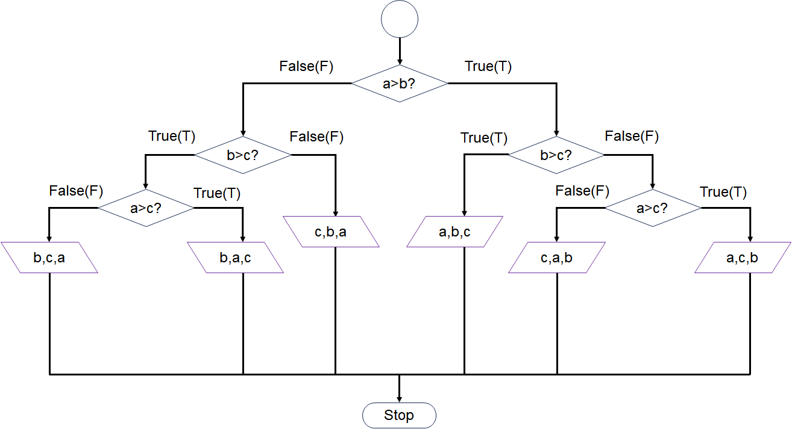
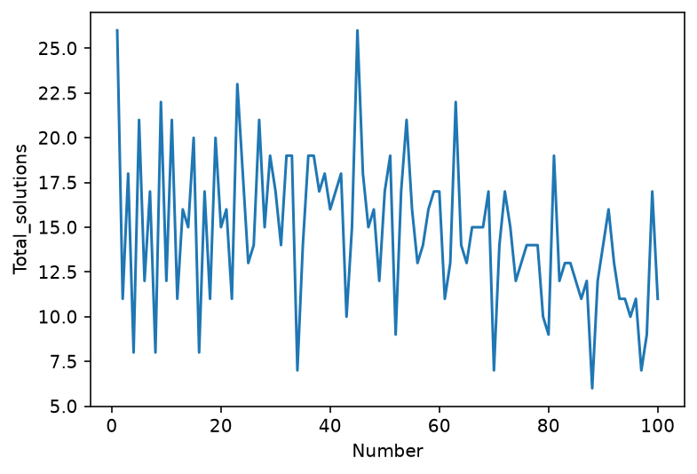

Assignment 01

**Name: 肖文赜**

**SUSTech ID: 12631523**

## Flowchart

**[10 points]** Write a function `Print_values` with arguments `a`, `b`, and `c` to reflect the following flowchart. Here the purple parallelogram operator is to print values in the given order. Report your output with some random `a`, `b`, and `c` values.


**解题思路：**题目中有提到purple parallelogram operator is to print values in the given order。比较后发现，经过一系列的判断，会将数字从大到小进行输出。例如a>b为False，b＞c为False，则可推出c＞b＞a（随机小数不考虑相等的情况），按顺序输出c，b，a。同时注意到题目给的流程图中，判断a＞b为False后再判断b＞c为True后，没有往下接流程图，结合题目意思，考虑补充流程图。如下图所示：



**程序：**PS1_1.py

```python
# -*- coding: utf-8 -*-
"""
Created on Thu Oct  8 22:52:53 2026
@author: 55471
"""
def Print_values(a,b,c):
    if(a>b):
        if(b>c):
            print(a,b,c)    
        else:
            if(a>c):
                print(a,c,b)
            else:
                print(c,a,b)
    else:
        if(b>c):
            if(a>c):
                print(b,a,c)
            else:
                print(b,c,a)
            
        else:
            print(c,b,a)
    return 

##主函数
import random
a=random.random()
b=random.random()
c=random.random()
print('random number a is:' + str(a))
print('random number b is:' + str(b))
print('random number c is:' + str(c))
Print_values(a,b,c)
```

**输入样例与输出结果报告：**

**Test#1**

| Input#1                                                      | Output#1                                                     |
| ------------------------------------------------------------ | ------------------------------------------------------------ |
| random number a is:0.1376348026894113<br />random number b is:0.9387575523534156<br />random number c is:0.6942940658437009 | 0.9387575523534156 <br />0.6942940658437009 <br />0.1376348026894113 |

**Test#2**

| Input#2                                                      | Output#2                                                     |
| ------------------------------------------------------------ | ------------------------------------------------------------ |
| random number a is:0.47702960150601437<br />random number b is:0.3393952645687328<br />random number c is:0.35997666397802863 | 0.47702960150601437 <br />0.35997666397802863 <br />0.3393952645687328 |

**Test#3**

| Input#3                                                      | Output#3                                                     |
| ------------------------------------------------------------ | ------------------------------------------------------------ |
| random number a is:0.3022115485341458<br />random number b is:0.237463675493091<br />random number c is:0.7472706790794602 | 0.7472706790794602<br />0.3022115485341458 <br />0.237463675493091 |

程序能够实现要求，对输入数字按指定顺序输出

## Matrix multiplication

**2.1 [5 points]** Make two matrices `M1` (`5` rows and `10` columns ) and `M2` (`10` rows and `5` columns ); both are filled with random integers from `0` and `50`.

**2.2 [10 points]** Write a function `Matrix_multip` to do matrix multiplication, *i.e.*, `M1 * M2`. Here you are **ONLY** allowed to use `for` loop, `*` operator, and `+` operator.

**解题思路：**对于2.1，要求创建两个矩阵M1和M2，矩阵是二维数据，考虑到python中单一个列表可以存储一维数据，如果在列表中再放一个列表就可以储存二维数据，因此使用两个for循环，每层表示一个维度。

对于2.2，要求计算矩阵乘法，根据[矩阵乘法的定义](https://baike.baidu.com/item/%E7%9F%A9%E9%98%B5%E4%B9%98%E6%B3%95/5446029)去做即可。
$$
C_{ij}= \sum_{k=1}^{n} a_{ik}b_{kj}
$$
因此使用一个三重for循环，分别表示公式中的i，j，k。对于这题而言，是5 * 10的矩阵M1与10 * 5的矩阵M2的乘法，最后会得到一个5 * 5的矩阵，因此i=5，j=5，k=10。

**程序：**PS1_2.py

**#Partial 2.1**

```python
# -*- coding: utf-8 -*-
"""
Created on Fri Oct  9 09:39:42 2026

@author: 55471
"""
import random

M1=[]
M2=[]
for i in range(5):
    M1_sub=[]
    for j in range(10):
        M1_sub.append(round(random.random()*50))
    M1.append(M1_sub)

for i in range(10):
    M2_sub=[]
    for j in range(5):
        M2_sub.append(round(random.random()*50))
    M2.append(M2_sub)

print(M1)
print(M2)

```

**#Partial 2.2**

```python
def Matrix_multip(M1,M2):
    ##保存结果
    ans_M=[]
    ##M1的第i行
    for i in range(5):
        ##M2的第j列
        sub_ans_M = []
        for j in range(5):
            ##总共有10个元素要进行计算
            ##temp_ans存储单次计算结果
            temp_ans = 0
            ##第k个元素
            for k in range(10):
                temp_ans = temp_ans + M1[i][k]*M2[k][j]
            sub_ans_M.append(temp_ans)
        ans_M.append(sub_ans_M)
    return ans_M
    
Matrix_multip(M1,M2)    
```

**输入样例与输出结果报告：**

**Test#1**

| Input#1                                                      | Output#1                                                     |
| ------------------------------------------------------------ | ------------------------------------------------------------ |
| [[42, 29, 35, 23, 10, 12, 29, 9, 23, 19], <br />[12, 16, 36, 44, 44, 16, 42, 40, 17, 5],<br /> [4, 16, 29, 21, 16, 13, 33, 33, 45, 49],<br /> [50, 28, 34, 37, 11, 29, 48, 3, 18, 3], <br />[5, 36, 38, 22, 11, 43, 21, 16, 43, 22]]<br /><br />[[45, 36, 37, 38, 33], <br />[29, 22, 7, 21, 23], <br />[39, 37, 13, 26, 6], <br />[2, 12, 27, 36, 40],<br /> [24, 10, 15, 20, 49],<br /> [15, 33, 43, 43, 2],<br /> [30, 42, 32, 5, 30], <br />[3, 27, 32, 31, 5],<br /> [19, 9, 12, 48, 48],<br /> [2, 46, 13, 12, 22]] | [[5934, 6759, 5238, 6415, 6134], <br />[5505, 6839, 6453, 7206, 7314],<br /> [4438, 7346, 5292, 6813, 6717],<br /> [6958, 7582, 6786, 7404, 6960], <br />[5243, 6884, 5525, 7724, 5984]] |

**Test#2**

| Input#2                                                      | Output#2                                                     |
| ------------------------------------------------------------ | ------------------------------------------------------------ |
| [[15, 7, 13, 24, 24, 32, 3, 32, 15, 45], <br />[6, 31, 41, 21, 23, 36, 41, 34, 40, 44], <br />[21, 31, 26, 43, 1, 49, 38, 27, 16, 30], <br />[12, 20, 43, 22, 9, 26, 8, 20, 6, 13], <br />[2, 36, 44, 3, 11, 37, 46, 6, 26, 5]]<br /><br />[[43, 31, 34, 46, 32], <br />[3, 34, 23, 48, 15],<br /> [23, 44, 36, 28, 31],<br /> [42, 0, 16, 43, 12],<br /> [42, 25, 36, 16, 29],<br /> [23, 26, 46, 2, 16], <br />[28, 10, 35, 40, 18],<br /> [37, 27, 28, 32, 33], <br />[21, 4, 40, 12, 34], <br />[4, 14, 33, 20, 32]] | [[5480, 4291, 6945, 5094, 5544],<br />[7392, 6659, 10652, 8343, 8051],<br />[7088, 5741, 9057, 8321, 6351],<br />[4607, 4671, 5797, 5150, 4382],<br />[4721, 5255, 7609, 5875, 4985]] |

程序能够创建两个矩阵M1,M2，并计算矩阵乘法

## Pascal triangle

**[20 points]** One of the most interesting number patterns is [Pascal’s triangle](https://www.mathsisfun.com/pascals-triangle.html) (named after Blaise Pascal). Write a function `Pascal_triangle` with an argument `k` to print the *k*th line of the Pascal triangle. Report `Pascal_triangle(100)` and `Pascal_triangle(200)`.

**解题思路：**要求输出帕斯卡三角形的第k层。帕斯卡三角形第一层是1，第二层是1,1，第三层是1,2,1，第四层是1,3,3,1。可以发现无论是哪一层，最左边和最右边的数都是1，而中间的数是上面一层两个数的和，假设层数为$i$，列数为$j$，则数字$a_{i,j}$可以表示为
$$
a_{i,j}=a_{i-1,j-1}+a_{i-1,j}
$$


根据上述公式写递推即可，此外由于题目不需要输出每层的结果，因此每次保留本层的结果，能保证推出下一层的结果即可。

**程序：**PS1_3.py

```python
# -*- coding: utf-8 -*-
"""
Created on Fri Oct  9 10:19:40 2026

@author: 55471
"""
def Pascal_triangle(k):
    ##初始化列表
    upper = []
    #第i层
    for i in range(1,k+1):
        #第i层有i个数字
        #初始化每层答案
        ans = []
        for j in range(1,i+1):
            #到达第k层需要输出
            if (j == 1): 
                ans.append(1)
            elif (j == i):
                ans.append(1)
                upper = ans.copy()
            else:
                ans.append(upper[j-1]+upper[j-2])
    return ans
    
k = round(float(input("Please enter the level:"))) 
Pascal_triangle(k)
```

**输出结果报告：**

第100层的帕斯卡三角

[1,
 99,
 4851,
 156849,
 3764376,
 71523144,
 1120529256,
 14887031544,
 171200862756,
 1731030945644,
 15579278510796,
 126050526132804,
 924370524973896,
 6186171974825304,
 38000770702498296,
 215337700647490344,
 1130522928399324306,
 5519611944537877494,
 25144898858450330806,
 107196674080761936594,
 428786696323047746376,
 1613054714739084379224,
 5719012170438571889976,
 19146258135816088501224,
 60629817430084280253876,
 181889452290252840761628,
 517685364210719623706172,
 1399667836569723427057428,
 3599145865465003098147672,
 8811701946483283447189128,
 20560637875127661376774632,
 45764000431735762419272568,
 97248500917438495140954207,
 197443926105102399225573693,
 383273503615787010261407757,
 711793649572175876199757263,
 1265410932572757113244012912,
 2154618614921181030658724688,
 3515430371713505892127392912,
 5498493658321124600506947888,
 8247740487481686900760421832,
 11868699725888281149874753368,
 16390109145274293016493707032,
 21726423750712434928840495368,
 27651812046361280818524266832,
 33796659167774898778196326128,
 39674339023040098565708730672,
 44739148260023940935799206928,
 48467410615025936013782474172,
 50445672272782096667406248628,
 50445672272782096667406248628,
 48467410615025936013782474172,
 44739148260023940935799206928,
 39674339023040098565708730672,
 33796659167774898778196326128,
 27651812046361280818524266832,
 21726423750712434928840495368,
 16390109145274293016493707032,
 11868699725888281149874753368,
 8247740487481686900760421832,
 5498493658321124600506947888,
 3515430371713505892127392912,
 2154618614921181030658724688,
 1265410932572757113244012912,
 711793649572175876199757263,
 383273503615787010261407757,
 197443926105102399225573693,
 97248500917438495140954207,
 45764000431735762419272568,
 20560637875127661376774632,
 8811701946483283447189128,
 3599145865465003098147672,
 1399667836569723427057428,
 517685364210719623706172,
 181889452290252840761628,
 60629817430084280253876,
 19146258135816088501224,
 5719012170438571889976,
 1613054714739084379224,
 428786696323047746376,
 107196674080761936594,
 25144898858450330806,
 5519611944537877494,
 1130522928399324306,
 215337700647490344,
 38000770702498296,
 6186171974825304,
 924370524973896,
 126050526132804,
 15579278510796,
 1731030945644,
 171200862756,
 14887031544,
 1120529256,
 71523144,
 3764376,
 156849,
 4851,
 99,
 1]

第200层帕斯卡三角：

[1,
 199,
 19701,
 1293699,
 63391251,
 2472258789,
 79936367511,
 2203959847089,
 52895036330136,
 1122550215450664,
 21328454093562616,
 366461620334848584,
 5741232051912627816,
 82585414900589338584,
 1097206226536401212616,
 13532210127282281622264,
 155620416463746238656036,
 1675208012521503627885564,
 16938214348828536681954036,
 161358778796735007338614764,
 1452229009170615066047532876,
 12378523459120956991548018324,
 100153507987433197477070330076,
 770746561468507650149628192324,
 5652141450769056101097273410376,
 39564990155383392707680913872632,
 264781087962950397351403038993768,
 1696560304355200694140471323923032,
 10421727583896232835434323846955768,
 61452255753319166029629978545842632,
 348229449268808607501236545093108248,
 1898412158917053376377708907120493352,
 9966663834314530225982971762382590098,
 50437359403955349931489584373269471102,
 246252990031076120253743264881256829498,
 1160906953003644566910503963011639339062,
 5288576119238825249258962498164134766838,
 23298321822592662584573267221641999107962,
 99324424612105561544759718155421154091838,
 410031599039717830992469605718533482276562,
 1640126396158871323969878422874133929106248,
 6360490170469769280761235835048470603119352,
 23927558260338655865720839569944246554591848,
 87363410392399278393445856104215039745835352,
 309743000482142896122217126187671504553416248,
 1066892557216269975532081212424201849017322632,
 3571770735028382091998706667681023581492775768,
 11627253669347711916506428088408438467412653032,
 36819636619601087735603688946626721813473401268,
 113464594480811515266860347570217040690499665132,
 340393783442434545800581042710651122071498995396,
 994483798684759751456599516938961121346144123804,
 2830453888564316215684167855903197037677487121596,
 7850504181489707239727786317316414425256426544804,
 21225437231435134388893644487559194557174782880396,
 55957970882874445207083244558110603832551700321044,
 143891925127391430532499771720855838426561515111256,
 360992022688017097651709953615480436754356081770344,
 883808055546524618388669196782727965846871786403256,
 2112151454780677477844107741463807511600151218353544,
 4928353394488247448302918063415550860400352842824936,
 11230182325145350742854190341225599501568017133650264,
 24996212272097716169578681727244076309941715555544136,
 54356842559958525638607609470356165943841508430310264,
 115508290439911866982041170124506852630663205414409311,
 239901833990586185270393199489360386232915888168388569,
 487073420526341648882313465629913511442586803250970731,
 966877088507514019423099864608634283908418579587747869,
 1876879054161644861233076207769701845233989007435039981,
 3563350088335876475674391061127984662690616811217249819,
 6617650164052342026252440542094828659282574077974892521,
 12023617903700734104036124365214547845738761352940297679,
 21375320717690193962730887760381418392424464627449418096,
 37187201796529515524203051309156714189560369968302412304,
 63318749004901607514183573850726297133575765081163566896,
 105531248341502679190305956417877161889292941801939278160,
 172182563083504371310499192050220632556214799782111453840,
 275044873497026463262225982106196594862524939911684530160,
 430198391879964468179379100217384417605487726528532213840,
 658911460980705071515251533244348285193215378606992378160,
 988367191471057607272877299866522427789823067910488567240,
 1452045626975998213153980230668100850703567223226520240760,
 2089529072965460843319142283156535370524645516350358395240,
 2945480741409143598413730688304995642787753318228818460760,
 4067568642898341159714199521944993982897373629935035017240,
 5503181105097755686672152294396168329802329028735635611560,
 7294914488152838933495643739083292902296110572975144880440,
 9475003875416905741206985546165656298384603387887257143560,
 12059095841439698216081617967847198925216767948220145455440,
 15039995937076477550393928027315045850551249912948720736560,
 18382217256426805894925912033385056039562638782492880900240,
 22018260230225514753262905622406275915520083816392571627760,
 25847522878960386884265150078476932596480098393156497128240,
 29738547828481305339960979122548728901326564817932744007760,
 33534958189564025170594295606278353867453360326605009200240,
 37064953788465501504341063564833970064027398255721325958160,
 40153699937504293296369485528570134236029681443698103121340,
 42637433954257136180681000097347668312485125656710356922660,
 44377737380961509086014918468667981304831457316167922511340,
 45274257328051640582702088538742081937252294837706668420660,
 45274257328051640582702088538742081937252294837706668420660,
 44377737380961509086014918468667981304831457316167922511340,
 42637433954257136180681000097347668312485125656710356922660,
 40153699937504293296369485528570134236029681443698103121340,
 37064953788465501504341063564833970064027398255721325958160,
 33534958189564025170594295606278353867453360326605009200240,
 29738547828481305339960979122548728901326564817932744007760,
 25847522878960386884265150078476932596480098393156497128240,
 22018260230225514753262905622406275915520083816392571627760,
 18382217256426805894925912033385056039562638782492880900240,
 15039995937076477550393928027315045850551249912948720736560,
 12059095841439698216081617967847198925216767948220145455440,
 9475003875416905741206985546165656298384603387887257143560,
 7294914488152838933495643739083292902296110572975144880440,
 5503181105097755686672152294396168329802329028735635611560,
 4067568642898341159714199521944993982897373629935035017240,
 2945480741409143598413730688304995642787753318228818460760,
 2089529072965460843319142283156535370524645516350358395240,
 1452045626975998213153980230668100850703567223226520240760,
 988367191471057607272877299866522427789823067910488567240,
 658911460980705071515251533244348285193215378606992378160,
 430198391879964468179379100217384417605487726528532213840,
 275044873497026463262225982106196594862524939911684530160,
 172182563083504371310499192050220632556214799782111453840,
 105531248341502679190305956417877161889292941801939278160,
 63318749004901607514183573850726297133575765081163566896,
 37187201796529515524203051309156714189560369968302412304,
 21375320717690193962730887760381418392424464627449418096,
 12023617903700734104036124365214547845738761352940297679,
 6617650164052342026252440542094828659282574077974892521,
 3563350088335876475674391061127984662690616811217249819,
 1876879054161644861233076207769701845233989007435039981,
 966877088507514019423099864608634283908418579587747869,
 487073420526341648882313465629913511442586803250970731,
 239901833990586185270393199489360386232915888168388569,
 115508290439911866982041170124506852630663205414409311,
 54356842559958525638607609470356165943841508430310264,
 24996212272097716169578681727244076309941715555544136,
 11230182325145350742854190341225599501568017133650264,
 4928353394488247448302918063415550860400352842824936,
 2112151454780677477844107741463807511600151218353544,
 883808055546524618388669196782727965846871786403256,
 360992022688017097651709953615480436754356081770344,
 143891925127391430532499771720855838426561515111256,
 55957970882874445207083244558110603832551700321044,
 21225437231435134388893644487559194557174782880396,
 7850504181489707239727786317316414425256426544804,
 2830453888564316215684167855903197037677487121596,
 994483798684759751456599516938961121346144123804,
 340393783442434545800581042710651122071498995396,
 113464594480811515266860347570217040690499665132,
 36819636619601087735603688946626721813473401268,
 11627253669347711916506428088408438467412653032,
 3571770735028382091998706667681023581492775768,
 1066892557216269975532081212424201849017322632,
 309743000482142896122217126187671504553416248,
 87363410392399278393445856104215039745835352,
 23927558260338655865720839569944246554591848,
 6360490170469769280761235835048470603119352,
 1640126396158871323969878422874133929106248,
 410031599039717830992469605718533482276562,
 99324424612105561544759718155421154091838,
 23298321822592662584573267221641999107962,
 5288576119238825249258962498164134766838,
 1160906953003644566910503963011639339062,
 246252990031076120253743264881256829498,
 50437359403955349931489584373269471102,
 9966663834314530225982971762382590098,
 1898412158917053376377708907120493352,
 348229449268808607501236545093108248,
 61452255753319166029629978545842632,
 10421727583896232835434323846955768,
 1696560304355200694140471323923032,
 264781087962950397351403038993768,
 39564990155383392707680913872632,
 5652141450769056101097273410376,
 770746561468507650149628192324,
 100153507987433197477070330076,
 12378523459120956991548018324,
 1452229009170615066047532876,
 161358778796735007338614764,
 16938214348828536681954036,
 1675208012521503627885564,
 155620416463746238656036,
 13532210127282281622264,
 1097206226536401212616,
 82585414900589338584,
 5741232051912627816,
 366461620334848584,
 21328454093562616,
 1122550215450664,
 52895036330136,
 2203959847089,
 79936367511,
 2472258789,
 63391251,
 1293699,
 19701,
 199,
 1]

## Add or double

**[20 points]** If you start with `1` RMB and, with each move, you can either double your money or add another `1` RMB, what is the smallest number of moves you have to make to get to exactly *x* RMB? Here *x* is an integer randomly selected from `1` to `100`. Write a function `Least_moves` to print your results. For example, `Least_moves(2)` should print `1`, and `Least_moves(5)` should print `3`.

**解题思路：**有点类似[数楼梯](https://www.luogu.com.cn/problem/P1255)的问题，或者取石子博弈的问题。一个给定的数，要么是由一个备选数$i$加1得到，要么是由另一个备选数$j$乘2得到。题目要求最小步数，可以想到，到达这个数的最小步数，肯定只能是是到达$i$的最小步数+1步，或者到达$j$的最小步数+1步。此外因为数字是递增的，所以我们只要保证能获得到达一个较小数字的最小步数，就可以推知到达其他较大数字的最小步数。但是额外需要注意奇数不能由偶数乘2得到，所以需要分奇偶的情况。

据此可以写出状态转移方程：
$$
cnt[i] = \begin{cases}
  0 &i=1 \\
  cnt[i-1]+1&i> 1,i为奇数 \\
  \text{min}(cnt[i-1],cnt[\frac{i}{2} ])+1&i为偶数
\end{cases}
$$
**程序：**PS1_4.py

```python
# -*- coding: utf-8 -*-
"""
Created on Fri Oct  9 10:44:54 2026

@author: 55471
"""
def Least_moves(x):
    cnt=[0,0]
    for i in range(2,x+1):
        if i%2 == 0:
            cnt.append(min(cnt[i-1]+1,cnt[i//2]+1))
        else:
            cnt.append(cnt[i-1]+1)
    return cnt[x]
    
x=int(input('Please enter your RMB:'))
Least_moves(x)
```

**输入样例与输出结果报告：**

**Test#1**

| Input#1 | Output#1 |
| ------- | -------- |
| 2       | 1        |

**Test#2**

| Input#2 | Output#2 |
| ------- | -------- |
| 5       | 3        |

**Test#3**

| Input#3 | Output#3 |
| ------- | -------- |
| 65      | 7        |

## Dynamic programming

**5.1 [30 points]** Write a function `Find_expression`, which should be able to print every possible solution that makes the expression evaluate to a random integer from `1` to `100`. For example, `Find_expression(50)` should print lines include:
$$
1−2+34+5+6+7+8−9=50
$$
and
$$
1+2+34−56+78−9=50
$$
**5.2 [5 points]** Count the total number of suitable solutions for any integer *i* from `1` to `100`, assign the count to a list called `Total_solutions`. Plot the list `Total_solutions`, so which number(s) yields the maximum and minimum of `Total_solutions`?

**解题思路：**对于5.1。实际上就是需要往1 2 3 4 5 6 7 8 9里面放加号和减号，然结果拼凑为50，一共有8个空位可以填东西，每个空位要么放加号，要么放减号，要么什么都不放。所以初步的思路是写一个8层for循环，每层循环枚举三种情况，枚举出总共3^8种情况，在最后一层循环内汇总结果，进行字符串的拼接，计算，判断结果是否等于目标值，再输出结果。但是代码比较不好看。

在这基础上可以简化一下，把这个看做一个递推的过程，从上到下总共进行8层的选择，每层选择做一件事（放加号，放减号，什么都不放），例如第一层可以产生1+，1-，1□的结果，每层又都可以产生一个分支进入第二层选择，例如1+可以产生1+2+，1+2-和1+2□，而1-可以产生1-2+，1-2-和1-2□，1□可以产生12+，12-，12□的结果，以此进行递推。直到第9层时计算一下结果并输出，返回一个表示有答案的1，可以考虑使用深度优先搜索**（本题使用的解法）**，递推枚举所有可能，递归返回计数结果。

据此也很自然可以想到另一种思路，上面提到了这是一个递推的过程，后一次产生的结果可以看做总是建立在前一次的结果之上。所以如果保存下了前一次所有的结果，那么就能产生后一次的结果。据此也可以考虑使用一个2层for循环，第一层for循环枚举8个层数，第二层for循环枚举保存的结果列表，每次循环，把结果列表中的所有字符串都取出来，进行上面所说的三个操作，随后再保存回新的结果列表，如此最后结束时也可枚举出所有的情况并计算出答案。但是最后要写一个汇总计算还是比较麻烦，不如深搜过程中可以顺便把答案也算了。

对于5.2，使用上面的程序可以直接获得解的个数，因此枚举从1到100都跑一遍程序即可。

**程序：**PS1_5.py

**#Partial 5.1**

```python
# -*- coding: utf-8 -*-
"""
Created on Thu Oct  8 23:37:27 2026

@author: 55471
"""
##考虑深度优先搜索
##穷尽位置即可，总共有8个位置可以插入符号
##每个位置有3种选择，什么都不做，插入加号，插入减号
##1 2 3 4 5 6 7 8 9
##初始化数字列表以及存储答案的列表
num_list = ['0','1','2','3','4','5','6','7','8','9']
Total_solutions = [0]
##计算函数
def cal(symb,res,temp):
    if(symb == 0):
        res = res + float(temp)
    else:
        res = res - float(temp)
    return res

##tar表示答案，deep为深度，symb=0,1表示加法和减法，res表示当前答案,temp表示临时截断的答案,fs用于输出完整字符串
def find_expression(tar,deep = 1,symb = 0,res = 0,temp = '',fs = ''):
    ##深度等于9最终结算
    if(deep == 9):
        res = cal(symb,res,temp+num_list[deep])
        if(res == tar):
            print(fs + num_list[deep] + '=' + str(tar))
            return 1
        return 0
    ##接下来，什么都不做，那就接着把数字补全
    count1 = find_expression(tar,deep+1,symb = symb,res = res,temp = temp + num_list[deep] ,fs=fs + num_list[deep])
    ##接下来加，数字截断，进行一次cal结算
    count2 = find_expression(tar,deep+1,symb = 0,res = cal(symb,res,temp + num_list[deep]),temp = '',fs = fs + num_list[deep] + "+")
    ##接下来减，数字截断，进行一次cal结算
    count3 = find_expression(tar,deep+1,symb = 1,res = cal(symb,res,temp + num_list[deep]),temp = '',fs = fs + num_list[deep] + "-")
    return count1 + count2 + count3

find_expression(50)
```

**#Partial 5.2**

```python
for i in range(1,101):
    Total_solutions.append(find_expression(i))


print(Total_solutions)

import matplotlib.pyplot as plt

# Get some data
x = range(1,101)
y = Total_solutions[1:101]

# Plot a line
plt.plot(x,y)

# Add x and y labels
plt.xlabel("Number")
plt.ylabel("Total_solutions")


# Show plot
plt.show
```

**输出结果报告：**

**#5.1**

12+3+4-56+78+9=5012-3+45+6+7-8-9=5012-3-4-5+67-8-9=501+2+34-56+78-9=501+2+34-5-6+7+8+9=501+2+3+4-56+7+89=501+2+3-4+56-7+8-9=501+2-34+5-6-7+89=501+2-3+4+56+7-8-9=501-23+4+5-6+78-9=501-23-4-5-6+78+9=501-2+34+5+6+7+8-9=501-2+34-5-67+89=501-2+3-45+6+78+9=501-2-34-5-6+7+89=501-2-3+4+56-7-8+9=501-2-3-4-5-6+78-9=50

17

以结果等于50为例，总共有17种情况，Find_expression函数能够给出具体的计算过程，以及总数统计结果。

**#5.2**

Total_Solution = [0, 26, 11, 18, 8, 21, 12, 17, 8, 22, 12, 21, 11, 16, 15, 20, 8, 17, 11, 20, 15, 16, 11, 23, 18, 13, 14, 21, 15, 19, 17, 14, 19, 19, 7, 14, 19, 19, 17, 18, 16, 17, 18, 10, 15, 26, 18, 15, 16, 12, 17, 19, 9, 17, 21, 16, 13, 14, 16, 17, 17, 11, 13, 22, 14, 13, 15, 15, 15, 17, 7, 14, 17, 15, 12, 13, 14, 14, 14, 10, 9, 19, 12, 13, 13, 12, 11, 12, 6, 12, 14, 16, 13, 11, 11, 10, 11, 7, 9, 17, 11]

其中$i=0$的情况并没有纳入考虑，所以Total_solution对应值为0。其他取值$i$从1到100都能获得对应的解



结合图片可以分析结果，当$i=1$或者$i=45$时，解的数量最多，有26种，当$i=88$时，解的数量最少，有6种

